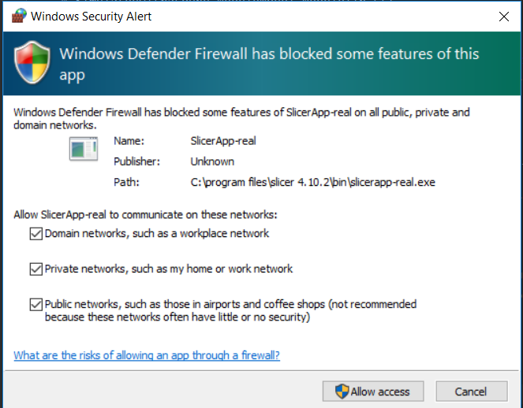
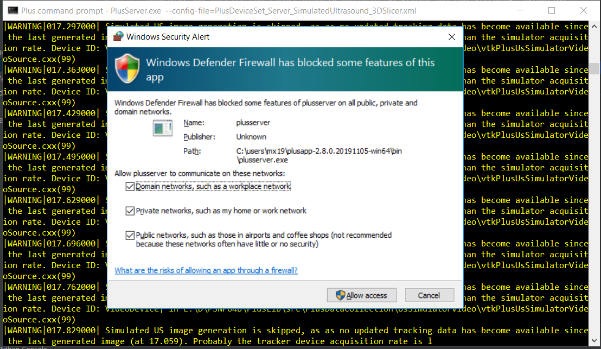

# Installation of 3dslicer

## Slicer under Ubuntu 18.04x64
* [download-untar](a_download-untar.bash)
``` 
bash a_download-untar.bash
```

* [dependencies](b_dependencies.bash)
**NOTE** This was not necessary for Ubuntu20.04
```
bash b_dependencies.bash
```

* Running slicer 
```
cd $HOME/Downloads/3dslicer*/Slicer-5*
./Slicer 
```

* Installation foodprint
```
du -sh Slicer-5.6.2-linux-amd64/
1.3G	Slicer-5.6.2-linux-amd64/
```


## * [ ] TOUPDATE: Windows Installation
Download the latest version of slicer from https://download.slicer.org/
```
version 4.11.20210226
revision 29738
built 2021-03-01
``` 
Destination folder: `C:\Users\mx19\AppData\Local\NA-MIC\Slicer 4.11.20210226`

* How to uninstall Slicer?
On Windows, choose "Uninstall" option from the Start menu.
https://www.slicer.org/wiki/Documentation/4.4/FAQ#How_to_uninstall_Slicer.3F    

* Firewall alerts       
   
   
  

## * [ ] TOTEST Installation of Slicer Extensions
Slides: https://onedrive.live.com/view.aspx?resid=7230D4DEC6058018!3101&ithint=file%2cpptx&authkey=!AAUo9vahA2-tB7g
### SlicerOpenIGTLink
### SlicerIGSIO
### SlicerJupyter
### SlicerIGT
https://github.com/SlicerIGT/SlicerIGT

## References
Slides: http://www.slicerigt.org/wp/user-tutorial/ 
