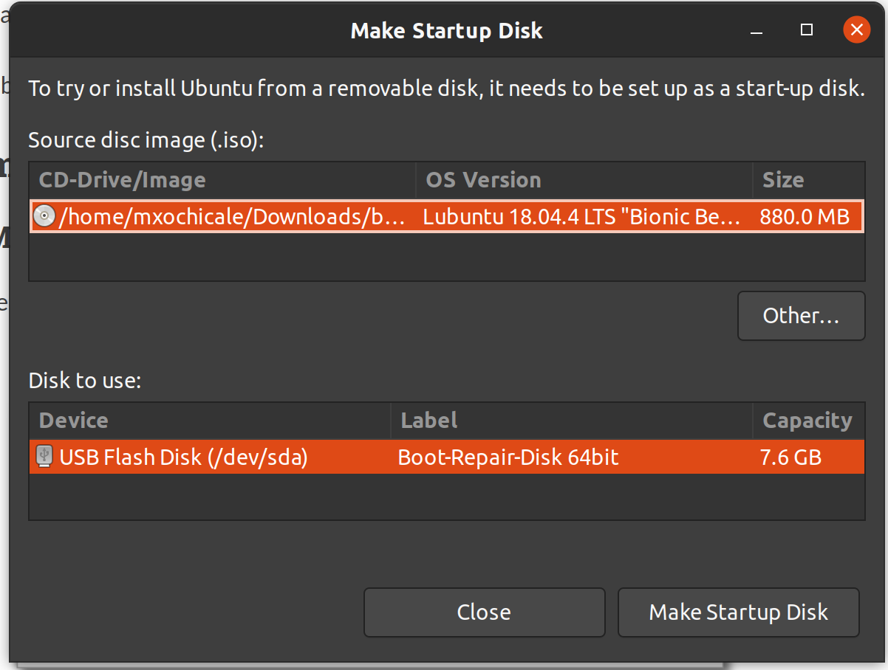

# boot-repair-disk 
> A rescue disk that includes the Boot Repair tool 

## Dowanload 
[boot-repair-disk-64bit.iso](https://sourceforge.net/projects/boot-repair-cd/files/latest/download)

## Make Bootable USB Stick

## Tutorials
https://www.youtube.com/watch?v=FiJokVR9YaY

## References 
https://sourceforge.net/projects/boot-repair-cd/files/latest/download

