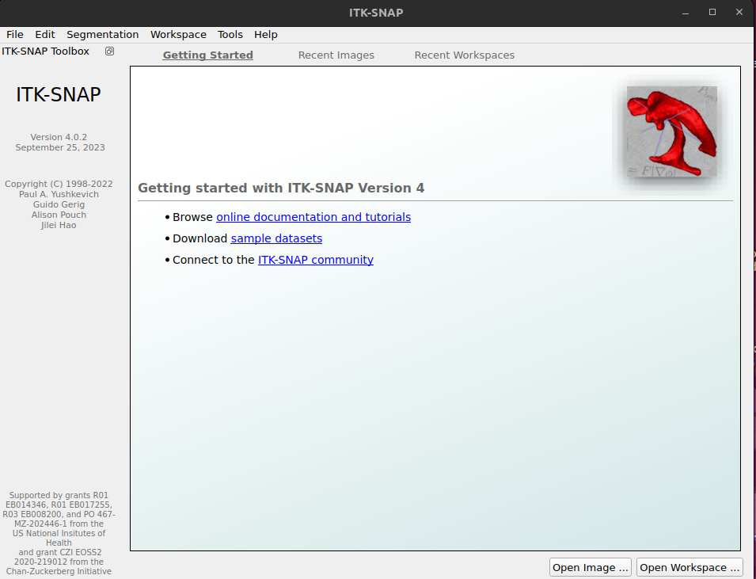

# ITK-SNAP Medical Image Segmentation Tool 

## Download and Install
``` 
bash download-installation.bash
```

## Footprint
```
du -sh itksnap-4.*
701M	itksnap-4.0.2-20230925-Linux-gcc64
```

## Datasets
Site for datasets http://www.itksnap.org/pmwiki/pmwiki.php?n=Downloads.Data
* Multi-modal brain tumor MRI [Zip archive (9.1 MB)] 
* Brain diffusion MRI dataset  [Zip archive (10.6 MB)]
```
bash download-datasets.bash
```

## Usage
* `itksnap-4*`
```
cd $HOME/Downloads/itksnap/itksnap-4.0*/bin
cd $HOME/Downloads/itksnap/itksnap-4.2*/bin
./itksnap
```

* `itksnap-4*` with `diffusion.itksnap`


## Source code 
* https://github.com/pyushkevich/itksnap 
* https://sourceforge.net/p/itk-snap/src/ci/master/tree/  
* https://sourceforge.net/projects/itk-snap/files/  
* https://sourceforge.net/projects/itk-snap/files/itk-snap/4.2.0/


## Issues 
### 01: error while loading shared libraries: libpng12.so.0 with itksnap-3.8.0-20190612-Linux-x86_64.tar.gz
Not sorted but only with the use of /repositories/ITK-SNAP/itksnap-4.0.0-alpha.3-20220203-Linux-gcc64/bin


