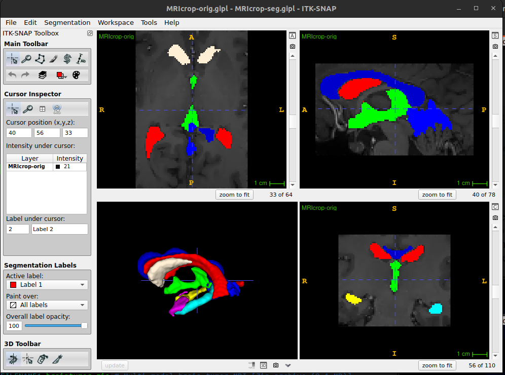

# ITK-SNAP Medical Image Segmentation Tool #35
> ITK-SNAP is a free, open-source, multi-platform software application used to segment structures in 3D and 4D biomedical images. It was originally developed at the University of North Carolina by student teams led by Guido Gerig (NYU Tanden School of Engineering), who envisioned a tool that would be easy to learn, with a limited feature set centered specifically on the task of image segmentation. Current ITK-SNAP development is led by Paul Yushkevich, Jilei Hao, Alison Pouch, Sadhana Ravikumar and colleagues at the Penn Image Computing and Science Laboratory (PICSL) at the University of Pennsylvania. http://www.itksnap.org/pmwiki/pmwiki.php 

## Download and Install
``` 
bash download-installation.bash
```

## Footprint
```
du -sh itksnap-4.*
701M	itksnap-4.0.2-20230925-Linux-gcc64
```

## Datasets
Site for datasets http://www.itksnap.org/pmwiki/pmwiki.php?n=Downloads.Data
* MRI-crop.zip #3D brain MRI for the SNAP 2.x tutorial 64MB
* Multi-modal brain tumor MRI [Zip archive (9.1 MB)] 
* Brain diffusion MRI dataset  [Zip archive (10.6 MB)]
```
bash get-datasets.bash
```

## Usage
* Launch `itksnap-4*`
```
cd $HOME/Downloads/itksnap/itksnap-4.0*/bin
cd $HOME/Downloads/itksnap/itksnap-4.2*/bin
./itksnap
```

* `itksnap-4*` with `diffusion.itksnap`   


* `itksnap-4*` with `MRIcrop` dataset
Open `MRIcrop-orig.gipl` as the main image and `MRIcrop-seg.gipl` as segmentation image to then click update!   



## Source code 
* https://github.com/pyushkevich/itksnap 
* https://sourceforge.net/p/itk-snap/src/ci/master/tree/  
* https://sourceforge.net/projects/itk-snap/files/  
* https://sourceforge.net/projects/itk-snap/files/itk-snap/4.2.0/


## References
* http://www.itksnap.org/docs/fullmanual.php


## Issues 
### 01: error while loading shared libraries: libpng12.so.0 with itksnap-3.8.0-20190612-Linux-x86_64.tar.gz
Not sorted but only with the use of /repositories/ITK-SNAP/itksnap-4.0.0-alpha.3-20220203-Linux-gcc64/bin

