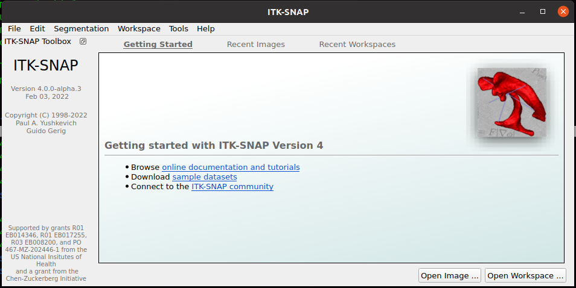

# ITK-SNAP Medical Image Segmentation Tool 

## Source code 
https://sourceforge.net/p/itk-snap/src/ci/master/tree/  
https://sourceforge.net/projects/itk-snap/files/  

## Download
* itksnap-3.8.0-20190612-Linux-x86_64.tar.gz
https://sourceforge.net/projects/itk-snap/files/itk-snap/3.8.0/itksnap-3.8.0-20190612-Linux-x86_64.tar.gz/download

* itksnap-experimental-vtk9qt6-Linux-gcc64.tar.gz
https://sourceforge.net/projects/itk-snap/files/itk-snap/Experimental/itksnap-experimental-vtk9qt6-Linux-gcc64.tar.gz


## Install
``` 
cd $HOME/repositories/ITK-SNAP
#wget https://sourceforge.net/projects/itk-snap/files/itk-snap/3.8.0/itksnap-3.8.0-20190612-Linux-x86_64.tar.gz
#tar -xvzf itksnap-3.8.0-20190612-Linux-x86_64.tar.gz
wget https://sourceforge.net/projects/itk-snap/files/itk-snap/Experimental/itksnap-experimental-vtk9qt6-Linux-gcc64.tar.gz
tar -xvzf itksnap-experimental-vtk9qt6-Linux-gcc64.tar.gz
```

## Usage

* itksnap-4.0.0
```
cd $HOME/repositories/ITK-SNAP/itksnap-4.0.0-alpha.3-20220203-Linux-gcc64/bin
./itksnap
```




## Examples of datasets
Site for datasets http://www.itksnap.org/pmwiki/pmwiki.php?n=Downloads.Data

* Multi-modal brain tumor MRI [Zip archive (9.1 MB)] 
* Brain diffusion MRI dataset  [Zip archive (10.6 MB)]


## Issues 
### 01: error while loading shared libraries: libpng12.so.0 with itksnap-3.8.0-20190612-Linux-x86_64.tar.gz
Not sorted but only with the use of /repositories/ITK-SNAP/itksnap-4.0.0-alpha.3-20220203-Linux-gcc64/bin


